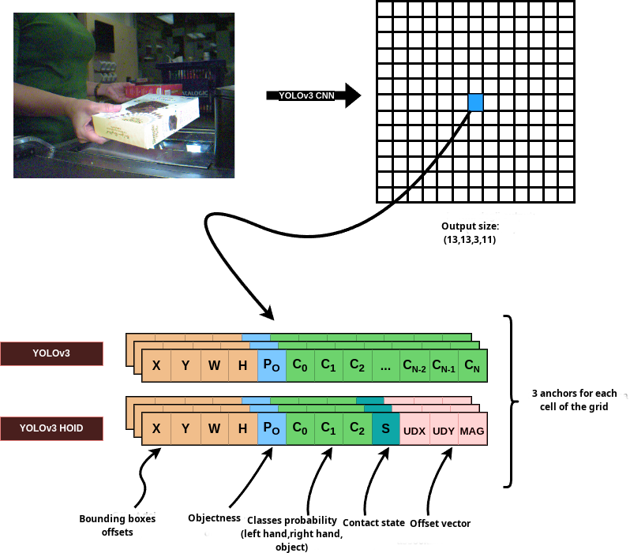

# Yolov3 based hand object detector

Yolov3 based hand object detector trained on [100DOH](https://arxiv.org/abs/2006.06669) dataset.


# Introduction
The code was written for my master thesis.
This repository uses Yolov3 implementation from [base_yolov3_implementation](https://github.com/eriklindernoren/PyTorch-YOLOv3/tree/master)
The model implementation is taken from [yolov3_model_implementation](https://github.com/aladdinpersson/Machine-Learning-Collection/tree/master/ML/Pytorch/object_detection/YOLOv3)

An implementation with deatached head is provided similar to [YOLOX: Exceeding YOLO Series in 2021](https://arxiv.org/abs/2107.08430)

# PrePrerequisites

Prepare a python or conda venv with the following packages:
* numpy
* opencv
* albumentations
* pytorch 
* cuda

## Performance (AP)
Overall the Yolov3 model is faster but the FasterRCNN model performs better
- Tested on the **100K binary** dataset:
<table><tbody>
<tr>
<td align="center">Name</td>
<td align="center">Hand</td>
<td align="center">Obj</td>
<td align="center">H+Side</td>
<td align="center">H+State</td>
<td align="center">H+O</td>
<td align="center">All</td>
</tr>

<tr>
<td align='left'>100K_BIN</td>
<td align='center'>52.6</td>
<td align='center'>81.1</td>
<td align='center'>63.5</td>
<td align='center'>49.0</td>
<td align='center'>37.5</td>
<td align='center'>36.6</td>
</tr>

</tbody></table>

- FasterRCNN vs Yolov3 speed:
<table><tbody>
<tr>
<td align="center">Model</td>
<td align="center">Latency (ms)</td>
</tr>

<tr>
<td align='left'>Faster-RCNN</td>
<td align='center'>78</td>
</tr>

<tr>
<td align='left'>Yolov3</td>
<td align='center'>12</td>
</tr>

</tbody></table>

## Training
To train you need to convert the original 100K dataset using 'parse_to_txt_all.py' script.
Then setup the paths correctly and train using the 'train.py' script.


</br>
</br>

```
@INPROCEEDINGS{Shan20, 
    author = {Shan, Dandan and Geng, Jiaqi and Shu, Michelle  and Fouhey, David},
    title = {Understanding Human Hands in Contact at Internet Scale},
    booktitle = CVPR, 
    year = {2020} 
}

@misc{redmon2018yolov3incrementalimprovement,
      title={YOLOv3: An Incremental Improvement}, 
      author={Joseph Redmon and Ali Farhadi},
      year={2018},
      eprint={1804.02767},
      archivePrefix={arXiv},
      primaryClass={cs.CV},
      url={https://arxiv.org/abs/1804.02767}, 
}

@misc{ge2021yoloxexceedingyoloseries,
      title={YOLOX: Exceeding YOLO Series in 2021}, 
      author={Zheng Ge and Songtao Liu and Feng Wang and Zeming Li and Jian Sun},
      year={2021},
      eprint={2107.08430},
      archivePrefix={arXiv},
      primaryClass={cs.CV},
      url={https://arxiv.org/abs/2107.08430}, 
}
```